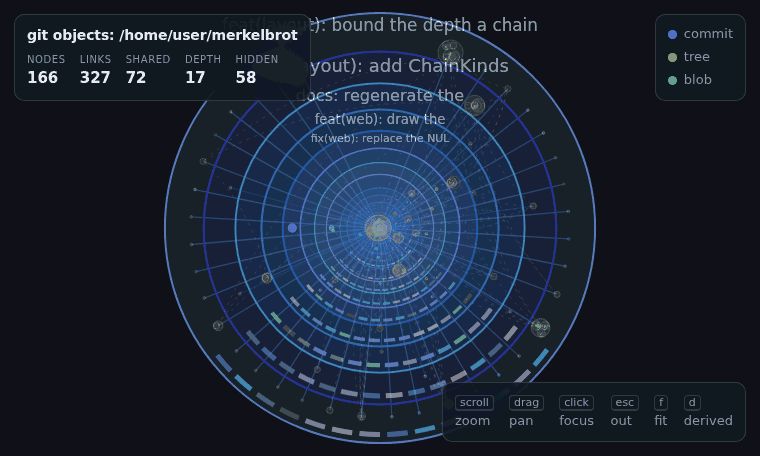

<h1 align="center">merkelbrot</h1>

<p align="center">
  <em>Zoomable, fractal-style visualisation for Merkle DAGs and trees.</em>
</p>

<p align="center">
  <a href="https://pkg.go.dev/github.com/danielriddell21/merkelbrot"></a>
  <a href="https://github.com/danielriddell21/merkelbrot/actions/workflows/ci.yaml"></a>
  <a href="https://goreportcard.com/report/github.com/danielriddell21/merkelbrot"></a>
  <a href="LICENCE"></a>
</p>

<p align="center">
  
</p>

## What it is

merkelbrot draws a Merkle DAG as nested circles and lets you zoom through it
continuously — from the whole graph, into a commit, into its trees, down to the
fields inside a single blob — without ever changing screens. Nesting follows the
[dominator tree](https://en.wikipedia.org/wiki/Dominator_(graph_theory)), so a
node reachable from several parents is drawn once, in the one place every route
to it must pass through, and the remaining edges are reported as reference links.
Trees and general DAGs go through the same interface: you describe your own
nodes, and the library never assumes where they came from.

## Install

```sh
go get github.com/danielriddell21/merkelbrot          # graph, layout, proof, scene
go get github.com/danielriddell21/merkelbrot/web      # templ renderer (separate module)
```

The core is a zero-dependency, standard-library-only module. The renderer is a
separate module so importing the core never pulls in templ or anything web.

For the demo binary:

```sh
brew install danielriddell21/tap/merkelbrot
# or
go install github.com/danielriddell21/merkelbrot/web/cmd/merkelbrot@latest
```

## Usage

Implement `graph.Source` over whatever your nodes are, then pack and render:

```go
src := graph.NewMemorySource([]string{"commit"},
	graph.Node[string]{ID: "commit", Kind: "commit", Label: "initial", Children: []string{"tree"}},
	graph.Node[string]{ID: "tree", Kind: "tree", Label: "/", Children: []string{"readme"}},
	graph.Node[string]{
		ID: "readme", Kind: "blob", Label: "README.md",
		Payload: []graph.Field{{Key: "size", Value: "184 B"}},
	},
)

g, err := graph.New(src)
if err != nil {
	log.Fatal(err)
}

s := scene.Builder[string]{Title: "my graph"}.Scene(layout.Pack(g, layout.Options{}))
if err := web.Render(context.Background(), os.Stdout, s); err != nil {
	log.Fatal(err)
}
```

That writes one self-contained HTML page — styles, viewer and data inlined — so
it opens with no server. A `*scene.Scene` is plain JSON, so any other front end
can consume it instead.

## Demo

```sh
merkelbrot serve -source git -repo .        # this repository's own object graph
merkelbrot serve -source ledger -n 24       # a generated UK payments ledger
merkelbrot export -source synthetic > x.html
```

The sources under [`examples/`](examples) double as reference implementations of
`graph.Source`: a git object reader (loose objects and packfiles, standard
library only), a generated payments ledger, and a synthetic content-addressed
DAG.

## Documentation

API documentation, including runnable examples, lives on
**[pkg.go.dev](https://pkg.go.dev/github.com/danielriddell21/merkelbrot)**.
